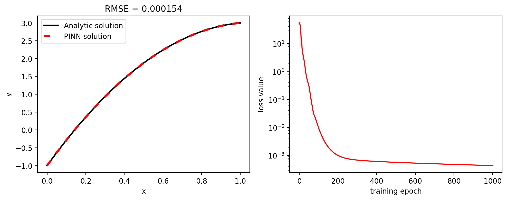
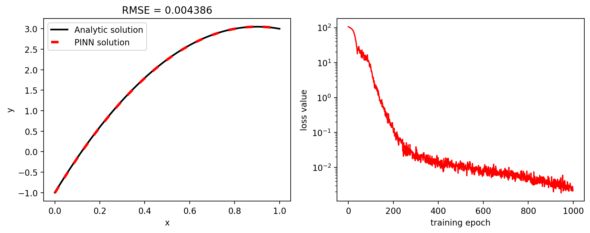
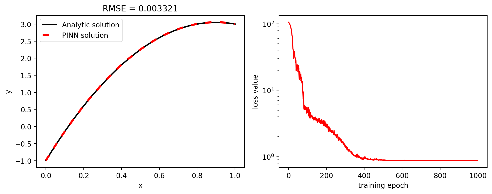

Code for the paper:
# Locally adaptive activation functions with slope recovery for deep and physics-informed neural networks

The paper is available at: https://royalsocietypublishing.org/doi/10.1098/rspa.2020.0334

### Authors
Ameya D. Jagtap, Kenji Kawaguchi, George Em Karniadakis

### Abstract
We propose two approaches of locally adaptive activation functions namely, layer-wise and neuron-wise locally adaptive activation functions, which improve the performance of deep and physics-informed neural networks. The local adaptation of activation function is achieved by introducing a scalable parameter in each layer (layer-wise) and for every neuron (neuron-wise) separately, and then optimizing it using a variant of stochastic gradient descent algorithm. In order to further increase the training speed, an activation slope-based slope recovery term is added in the loss function, which further accelerates convergence, thereby reducing the training cost. On the theoretical side, we prove that in the proposed method, the gradient descent algorithms are not attracted to sub-optimal critical points or local minima under practical conditions on the initialization and learning rate, and that the gradient dynamics of the proposed method is not achievable by base methods with any (adaptive) learning rates. We further show that the adaptive activation methods accelerate the convergence by implicitly multiplying conditioning matrices to the gradient of the base method without any explicit computation of the conditioning matrix and the matrix–vector product. The different adaptive activation functions are shown to induce different implicit conditioning matrices. Furthermore, the proposed methods with the slope recovery are shown to accelerate the training process.

### BibTeX entry
```tex
@article{Jagtap2020,
    author = {Ameya D. Jagtap and Kenji Kawaguchi and George Em Karniadakis},
    title = {Locally adaptive activation functions with slope recovery for deep and physics-informed neural networks},
    journal = {Proceedings of the Royal Society A: Mathematical, Physical and Engineering Sciences},
    year = {2020},
    doi = {10.1098/rspa.2020.0334},
}
```

## About this repository
This repository contains a simplified version of the neuron-wise locally adaptive activation functions (N-LAAF) applied to physics-informed neural networks (PINNs) to solve 1-D Poisson equation with scalar right-hand-side function on aribtrary domain with arbitrary Dircihlet boundary conditions as a toy example.

PINNs are relatively new concept and a very efficient method for solving forward and inverse (partial) differential and integro-differential equations involving noisy, sparse and multi-fidelity data.
The main feature of PINNs is that they incorporate all
prior information on the underlying dynamics of the governing equation, experimental/measured data, initial/boundary conditions, etc., into the loss function thereby recast the original problem into an optimization problem.
Mathematical details of PINNs are available in [the seminal 2019 paper](https://www.sciencedirect.com/science/article/pii/S0021999118307125) by Raissi et al. 

The key idea behind *adaptive activation functions* for PINNs is introduced in its infant version in [the paper](https://www.sciencedirect.com/science/article/pii/S0021999119308411?via%3Dihub) by Jagtap et al., where authors introduce a scalable parameter in an activation function, which can be optimized by using any optimization algorithm.
Mathematically, the adaptive scalabale parameter affects the slope of activation functions, thus increasing the learning process by altering the loss landscape of the neural network, especially during the initial training period.
Since this approach uses only a single learnable paramater, such activation functions are known as *globally adaptive activation functions* (GAAFs).

The same authors introduce the idea of multiple scalable parameters applied layer-wise or even neuron-wise where such locally defined activation slopes are able to further improve the performance of the network but at the same time the parameter space grows larger.
Even though the parameter space is considerably larger compared to the fixed activation function (additional $D-1$ parameters to be optimized along with weights and biases applied layer-wise, and additional $\sum_{k=1}^{D-1}N_k$ parameters applied neuron-wise, where $D$ is the number of hidden layers and $N$ is the number of neurons per $k$-th hidden layer), the overall computational cost is comparable.
For details on *layer-wise locally adaptive functions* (L-LAAFs) and *neuron-wise locally adaptive functions* (N-LAAFs), check [the paper](https://royalsocietypublishing.org/doi/10.1098/rspa.2020.0334), especially Section 2 of the paper.
Furthermore by increasing the slope of activation functions, problems such as vanishing gradients are avoidable by including the slope recovery term into the loss function itself, therby achieveing faster training of the network.

## Setup
To run this code you need the following:
* clone the repository to your local machine:
    ```shell
    $ git clone https://github.com/antelk/locally-adaptive-activation-functions.git
    ```
    and enter the local repository:
    ```shell
    $ cd locally-adaptive-activation-functions
    ```
* install `Python3` (`Python3.8.5` is used for the development) and other requirements given in [environement.yml](https://github.com/antelk/locally-adaptive-activation-functions/blob/main/environment.yml) file, preferably in a separate environment to avoid dependancy-related issues:
    ```shell
    $ conda env create -f environment.yml
    ``` 
* instead, if you have a CUDA GPU, you want to install PyTorch supporting cudatoolkit manually. E.g., using `conda` installer, run the following command:
    ```shell
    $ conda install pytorch cudatoolkit=11.0 -c pytorch
    ```
    for the latest supported cudatoolkit using Python3. 
    
    `Python3.9` users will need to add ```-c=conda-forge``` flag, for details go to [the official installation webpage](https://pytorch.org/).

The code is tested for both Windows 10 and GNU/Linux operating systems. Unfortunatelly, there are no unit tests that support the previous claim :D

## Run the experiments
`poisson.py` is the main (and the only) script to run the experiments.
Arguments that could be passed into the script are listed as follows:
```shell
$ python poisson.py --help
usage: poisson.py [-h] [--cuda] [--domain DOMAIN DOMAIN]
                  [--boundary_conditions BOUNDARY_CONDITIONS BOUNDARY_CONDITIONS]
                  [--rhs RHS] [--n_layers N_LAYERS] [--n_units N_UNITS]
                  [--activation ACTIVATION] [--optimizer {bfgs,sgd,adam}]
                  [--n_epochs N_EPOCHS] [--batch_size BATCH_SIZE] [--linspace]
                  [--learning_rate LEARNING_RATE]
                  [--dropout_rate DROPOUT_RATE] [--apply_mcdropout]
                  [--adaptive_rate ADAPTIVE_RATE]
                  [--adaptive_rate_scaler ADAPTIVE_RATE_SCALER]
                  [--save_fig SAVE_FIG]

optional arguments:
  -h, --help            show this help message and exit
  --cuda                Use CUDA GPU for training if available
  --domain DOMAIN DOMAIN
                        Boundaries of the solution domain
  --boundary_conditions BOUNDARY_CONDITIONS BOUNDARY_CONDITIONS
                        Boundary conditions on boundaries of the domain
  --rhs RHS             Right-hand-side forcing function
  --n_layers N_LAYERS   The number of hidden layers of the neural network
  --n_units N_UNITS     The number of neurons per hidden layer
  --activation ACTIVATION
                        activation function
  --optimizer {bfgs,sgd,adam}
                        Optimization procedure
  --n_epochs N_EPOCHS   The number of training epochs
  --batch_size BATCH_SIZE
                        The number of data points for optimization per epoch
  --linspace            Space the batch of data linearly, otherwise random
  --learning_rate LEARNING_RATE
                        Learning rate applied for gradient based optimizers
  --dropout_rate DROPOUT_RATE
                        Dropout regularization rate
  --apply_mcdropout     Apply MCdropout for uncertainty quantification
  --adaptive_rate ADAPTIVE_RATE
                        Add additional adaptive rate parameter to activation
                        function
  --adaptive_rate_scaler ADAPTIVE_RATE_SCALER
                        Apply constant scaler to the adaptive rate
  --save_fig SAVE_FIG   Save figure with specified name
```

### Experiment 1
PINN with an input layer, $3$ hidden layers with $50$ units per each hidden layer, and an output layer. Optimization is performed using stochastic gradient descent algorithm with momentum using a learning rate of $0.001$.
```shell
$ python poisson.py --cuda --domain -1 1 --boundary_conditions -1 3 --rhs -7 --n_layers 3 --n_units 100 --activation tanh --optimizer sgd --n_epochs 1000 --batch_size 32 --linspace --learning_rate 1e-3 --save_fig experiment_1
```


### Experiment 2
Unlike the previous experiment, here the batch contains $101$ data points randomly spaced over the solution domain.
For this experiment, ADAM optimization is performed over $5000$ epochs.
```shell
$ python poisson.py --cuda --domain 0 1 --boundary_conditions -1 3 --rhs -10 --n_layers 3 --n_units 50 --activation tanh --optimizer adam --n_epochs 5000 --batch_size 101 --learning_rate 1e-3 --save_fig experiment_2
```


### Experiment 3
Repeating the previous experiment only instead by applying adaptive activation functions and slope-recovery term into the loss function.
```shell
$ python poisson.py --cuda --domain 0 1 --boundary_conditions -1 3 --rhs -10 --n_layers 3 --n_units 50 --activation tanh --optimizer adam --n_epochs 5000 --batch_size 101 --learning_rate 1e-3 --adaptive_rate 0.3 --save_fig experiment_3
```


### Experiment 4
Uncertainty quantification using Monte Carlo dropout procedure.
For details on the method check [the seminal paper](http://proceedings.mlr.press/v48/gal16.pdf) by Gal and Ghahramani.
PINN with $3$ hidden layers and $100$ units per each hidden layer is used with the dropout rate of $0.01$ during both the training and testing time.
$95\%$ confidence interval is achieved by adding and subtracting $2$ standard deviations from the expected value from $1000$ evaluated samples on the output of the PINN.
For this experiment, instead of gradient-based optimizers, L-BFGS-B optimizer is used.
Since L-BFGS-B uses an automatically differentiated inverse Hessian matrix to steer its search through parameter space, the adaptive activation functions are not necessary (check the paper).
The number of epochs is lower considerably than in previous experiments.
```shell
$ python poisson.py --cuda --domain 0 1 --boundary_conditions -1 3 --rhs -10 --n_layers 3 --n_units 100 --activation tanh --optimizer bfgs --n_epochs 100 --batch_size 101 --dropout_rate 0.01 --apply_mcdropout --save_fig experiment_4 
```


## Author
© [Ante Lojic Kapetanovic](http://adria.fesb.hr/~alojic00/)